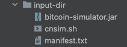
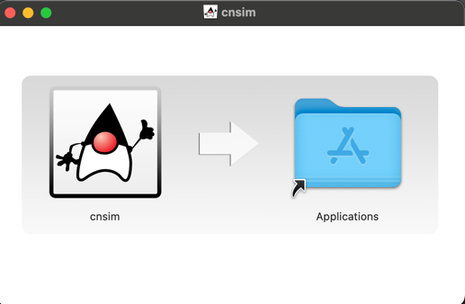

# Distributing CNSim CLI Application (Developer Guide)

## Table of Contents
- [Distributing CNSim CLI Application (Developer Guide)](#distributing-cnsim-cli-application)
    - [Pros and Cons](#pros-and-cons)
        - [Method 1: JAR + Shell Script](#method-1-jar--shell-script-developer-guide)
        - [Method 2: `jpackage` and sharing the bundle](#method-2-jpackage-and-sharing-the-bundle)
    - [How to make a JAR file + Run it](#how-to-make-a-jar-file--run-it)
        - [Step 1: Compile `.java` files](#step-1-compile-java-files)
        - [Step 2: Make a manifest file](#step-2-make-a-manifest-file)
        - [Step 3: Create a JAR file](#step-3-create-a-jar-file)
        - [Step 4: Run JAR file](#step-4-run-jar-file)
        - [Step 5 (Optional): Make Bash script to run JAR](#step-5-optional-make-bash-script-to-run-jar)
    - [How to use jpackage](#how-to-use-jpackage)
        - [Example for `dmg` on MacOS](#example-for-dmg-on-macos)
    
  
There are 2 common ways to distribute Java applications:
1. Make a JAR file (and optionally a shell script), package them into a zip file, then share the zip.
2. Make a JAR file, then use `jpackage` to create native installers/packages (`.dmg`, `.exe`, `.msi`, and so on) for Java applications, bundling the application, its dependencies, and a Java Runtime Environment (JRE) into a single package. Share this installer to give end users a natural installation experience on their platform. 

[YouTube Video on jpackage here.](https://www.youtube.com/watch?v=-6q_MKtPL3o) This video does mention `javapackager` and
it is now deprecated. `jpackage` is a packaging tool introduced in Java 14 to replace `javapackager`.

[Inside Java Podcast on jpackage here.](https://youtu.be/qu6yBo0eZYI?si=AhMWgAP1jnEll6Um&t=89)

### Pros and Cons

#### Method 1: JAR + Shell Script

Pros:
- Simplicity: Easy to set up and distribute if familiar with creating JAR files.
- Flexibility: Users can customize how they run the application (e.g., passing custom JVM options).

Cons:
- Java Dependency: Users need to have a compatible version of Java installed.
- Manual Installation: Users need to manually extract the files, set permissions, and run the script from the terminal, which can be cumbersome for non-technical users.

#### Method 2: `jpackage` and sharing the bundle

Pros:
- No Java Dependency: The application bundle includes a JRE, so users don’t need to install Java themselves.
- User-Friendly Installation: `jpackage` creates a native installer that users can run just like any other software installer.
- Platform Integration: The application integrates more seamlessly with the operating system, creating shortcuts and behaving like a native app.
- Security: The package can be signed and notarized, giving users confidence that the application is safe to run.
- Less Technical Steps: Users typically just need to double-click the installer and follow the prompts, without worrying about command-line usage or file permissions.

Cons:
- Size: The resulting package may be larger because it includes the JRE. 
- Platform Specificity: Each package is tailored for a specific platform and may need to create multiple packages for different operating systems.

### How to make a JAR file + Run it

Make sure to start in the `cnsim` folder. For this example, I will make a `BitcoinMainDriver` into a CLI app.

#### Step 1: Compile `.java` files

Compile all java files in `src/cmg/cnsim` that are not in any `test` folders nor `tangle`.
The compiled files (`*.class`) will be in `../compiled_classes` directory. 

```bash
find src/cmg/cnsim -name "*.java" | grep -v "/test/" | grep -v "/tangle/" | xargs javac -d ../compiled_classes -sourcepath src
```

Rest of the work will be done in parent directory. `compiled_classes` should be located there (`ls`).

```bash
cd ..
ls
```

#### Step 2: Make a manifest file

A `manifest.txt` file is a configuration file that defines the contents of the `MANIFEST.MF` file within the JAR. 
This file defines important metadata and configuration details that control how the JAR behaves and is executed. 
For instance, specifying the entry point of executable JARs and managing dependencies via the classpath.

Make `manifest.txt`:
```
Manifest-Version: 1.0
Main-Class: cmg.cnsim.bitcoin.BitcoinMainDriver
Implementation-Title: CNSim
Implementation-Version: 1.0
Implementation-Vendor: Enterprise Systems Group
Signed-By: Enterprise Systems Group
```

| Header           | Description                                                                                                                                    |
|:-----------------|:-----------------------------------------------------------------------------------------------------------------------------------------------|
| Main-Class       | Specifies the entry point of the application. This tells the JVM which class contains the main method to be executed when the JAR file is run. |
| Manifest-Version | Specifies the version of the manifest file format.                                                                                             |

The rest of the parts are optional metadata that are not essential for the JAR’s functionality.


#### Step 3: Create a JAR file

| `jar` Options/Args      | Description                                                                                                                                                                                             |
|:------------------------|:--------------------------------------------------------------------------------------------------------------------------------------------------------------------------------------------------------|
| c                       | Create a new JAR file.                                                                                                                                                                                  |
| v                       | Generate verbose output, listing the files that are being added to the JAR.                                                                                                                             |
| f                       | Specify the output file name (`bitcoin-simulator.jar`).                                                                                                                                                 |
| m                       | Include a manifest file (`manifest.txt`).                                                                                                                                                               |
| `bitcoin-simulator.jar` | The name of the JAR file to be created.                                                                                                                                                                 |
| `manifest.txt`          | The manifest file to include in the JAR.                                                                                                                                                                |
| `-C compiled_classes .` | Changes the directory to `compiled_classes` before adding the files to the JAR. <br/>The `.` (dot) indicates that all files and subdirectories within `compiled_classes` should be included in the JAR. |
| t                       | Table of contents. List the files inside the JAR archive.                                                                                                                                               |


Create a JAR file (`bitcoin-simulator.jar`) and package it with the specified manifest file (`manifest.txt`).
```bash
jar cvfm bitcoin-simulator.jar manifest.txt -C compiled_classes .
```

Check and view the contents of the JAR file.
```bash
jar tf bitcoin-simulator.jar
```
Output would look like this:
```
META-INF/MANIFEST.MF
META-INF/
cmg/
cmg/cnsim/
cmg/cnsim/bitcoin/
cmg/cnsim/bitcoin/BitcoinMainDriver.class
cmg/cnsim/bitcoin/BitcoinNode.class
cmg/cnsim/bitcoin/BitcoinNodeFactory.class
cmg/cnsim/bitcoin/BitcoinReporter.class
...
```

#### Step 4: Run JAR file

Run `bitcoin-simulator.jar` with same CLI args as in an IDE.

_Note: Will need to have a compatible Java version_
```bash
java -jar bitcoin-simulator.jar -c config.txt
```

#### Step 5 (Optional): Make Bash script to run JAR

Make `cnsim.sh`:
```bash
#!/bin/sh
java -jar ./bitcoin-simulator.jar "$@"
```

Change execution permission:
```bash
chmod +x cnsim.sh
```

Run `cnsim.sh` with same CLI args as in an IDE.

```bash
./cnsim.sh  -c config.txt
```

---

### How to use jpackage

After doing [Step 3: Create a JAR file](#step-3-create-a-jar-file), 
make a new directory and call it `input-dir`. Move main executable JAR file (`bitcoin-simulator.jar`) into `input-dir`.

If the application relies on external libraries or dependencies that are not bundled in the JAR, include these JAR files as well.
Typically, the `manifest.txt` is already included in the JAR file. If it is, you don’t need to provide it separately in the input-dir.

If done [Step 5 (Optional): Make Bash script to run JAR](#step-5-optional-make-bash-script-to-run-jar), you can move `cnsim.sh` into 
`input-dir`. It is not strictly necessary unless you want to include it as part of the application package for distribution.

```
input-dir/
│
├── bitcoin-simulator.jar
├── cnsim.sh (optional, if you want to share Bash script)
├── lib/ (only if you have additional libraries)
│   └── some-library.jar
└── manifest.txt (optional, if not included in the JAR)
```

jpackage command packages the Java application into a `--type` installer. 
It bundles the specified JAR file (`bitcoin-simulator.jar`) and any other files in the input-dir directory.

```bash
jpackage --input input-dir \
         --name cnsim \
         --main-jar bitcoin-simulator.jar \
         --main-class cmg.cnsim.bitcoin.BitcoinMainDriver \
         --type ... \ #  Pass the desired package type as an argument (e.g., dmg, msi, deb)
         --dest output-dir \
         --verbose
```

The `--type` option specifies the format of the installer or application bundle you want to create. Here are the common options:

| `--type` Option Args | Description                                                                                                                                                                     | Platforms            |
|:---------------------|:--------------------------------------------------------------------------------------------------------------------------------------------------------------------------------|----------------------|
| `app-image`          | Creates an application image that can be run directly without installing it. This is a directory structure containing your application and the necessary runtime.               | Cross-platform       |
| `dmg`                | Creates a macOS Disk Image (.dmg) file, commonly used for distributing macOS applications. The user can mount the `.dmg` and drag the application to their Applications folder. | macOS                |
| `pkg`                | Creates a macOS Installer Package (.pkg) file, which provides a standard installation process on macOS.                                                                         | macOS                |
| `exe`                | Creates a Windows executable installer (.exe) that can be used to install the application on Windows machines.                                                                  | Windows              |
| `msi`                | Creates a Windows Installer Package (.msi) file, used to install, maintain, and remove software on Windows systems.                                                             | Windows              |
| `deb`                | Creates a Debian package (.deb), which is used for installing applications on Debian-based Linux distributions like Ubuntu.                                                     | Linux (Debian-based) |
| `rpm`                | Creates an RPM package (.rpm), used for installing applications on RPM-based Linux distributions like Fedora and CentOS.                                                        | Linux (RPM-based)    |

---

#### Example for `dmg` on macOS:

Set up `input-dir`



Run this jpackage command:
```bash
jpackage --input input-dir \
         --name cnsim \
         --main-jar bitcoin-simulator.jar \
         --main-class cmg.cnsim.bitcoin.BitcoinMainDriver \
         --type dmg \ 
         --dest output-dir \
         --verbose
```
The dmg output is found in `output-dir` directory:


Follow installation process:



Move `cnsim.app` inside `cnsim` directory to use files in `cnsim/resources/...`.

Run `cnsim` with CLI args as usual:
```bash
cnsim.app/Contents/MacOS/cnsim -c config.txt
```

Output of running the program:
```
% cnsim.app/Contents/MacOS/cnsim -c config.txt
Current directory: ...
{config.file=config.txt}
Resolved Config file path:.../cnsim/resources/config.txt
Resolved Workload file path: .../cnsim/resources/workload.csv
Resolved Network file path:.../cnsim/resources/net.csv
Resolved Node file path: .../cnsim/resources/nodelist.csv
Current Index: 0 for seedArray [J@7b69c6ba
Setting the seed of java.util.Random@76a3e297 to 444
The nodes file does not contain enough lines as per configuration file. Required: 5, Found: 3. Additional nodes to be drawn from alternative sampler.
Scheduling sampler with chain [...] to swich to next seed at 2500
Creating file-based workload sampler
The transaction file does not contain enough lines as per configuration file. Required: 100, Found: 19. Additional arrrivals to be drawn from alternative sampler.
Nodeset created
Nodes added
Creating file-based network.
Current Index: 1 for seedArray [J@7b69c6ba
Setting the seed of java.util.Random@76a3e297 to 222

Real time(ms): 70
Simulation time(ms): 10064
```

```
cnsim.app/Contents/MacOS/cnsim -h                
Current directory: ...
Usage: cnsim [options]
Options:
  -c, --config <file>           Configuration file path - config.file (required)
  -m, --sims <long>             Number of simulations (Default 1) - sim.numSimulations
  --wl <file>           Workload file path - workload.sampler.file
  --net <file>          Network file path - net.sampler.file
  --node <file>         Node file path - node.sampler.file
  --out <directory>             Output directory path - sim.output.directory
  --ws, --workload-seed <long>          Workload seed - workload.sampler.seed
  --ns, --node-seed <list>              Node seed list (format: {long,long,...}) - node.sampler.seed
  --st, --switch-times <list>           Switch times list (format: {long,long,...}) - node.sampler.seedUpdateTimes
  --es, --net-seed <long>               Network seed - net.sampler.seed
  -h, --help            Print this help message
```

_Note: Unlike in IDE edit configuration, running `cnsim` in terminal needs --ns and --st argument value be surrounded 
by single or double quotations, `"{...}"` or `'{...}'`_

```bash
cnsim.app/Contents/MacOS/cnsim -c config.txt --ns "{1,2}"
```
